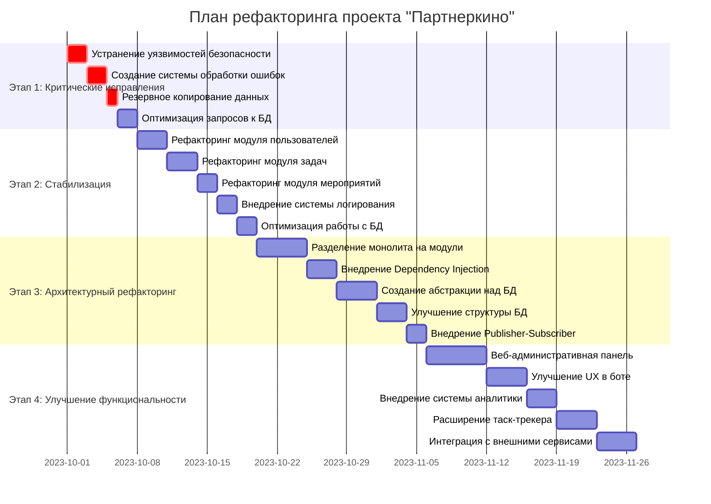
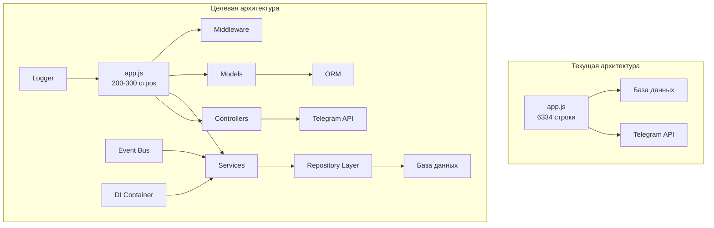
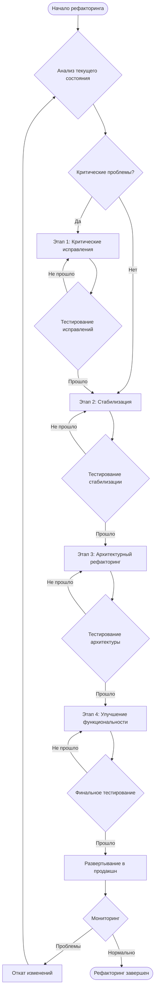
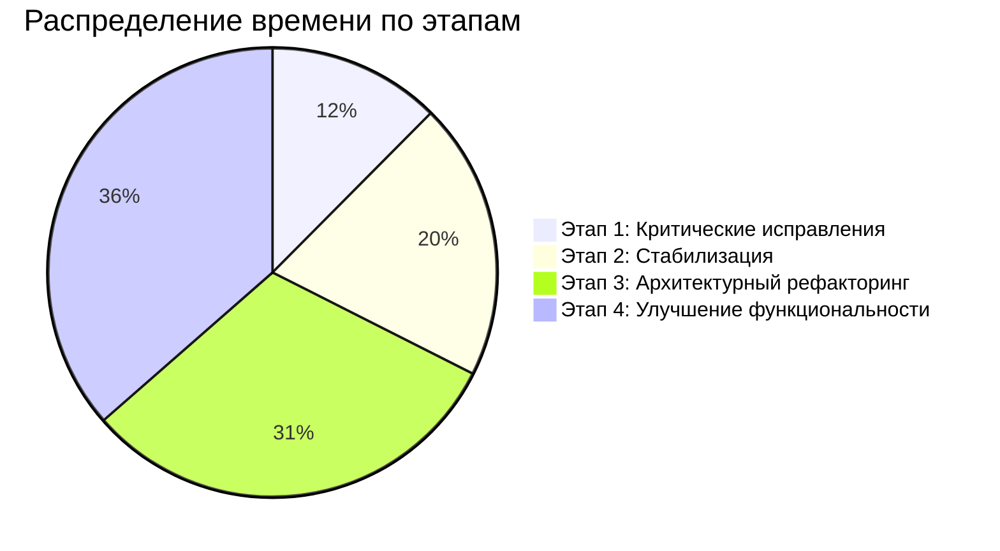
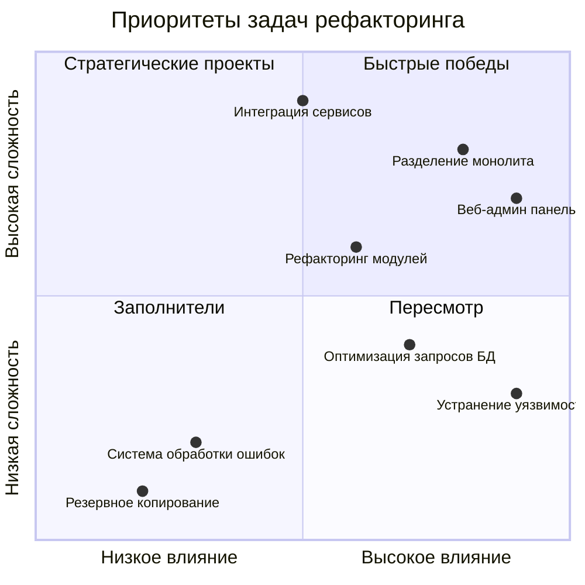
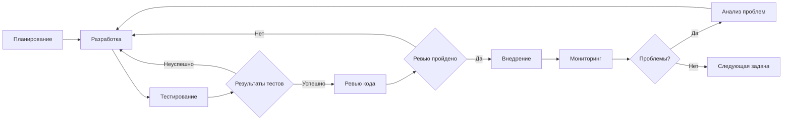

# 📊 Диаграмма плана рефакторинга проекта "Партнеркино"

## 🎯 Общая структура плана



## 🏗️ Архитектурные изменения



## 🔄 Процесс рефакторинга



## 📊 Распределение усилий по этапам



## 🎯 Приоритеты задач



## 🔄 Цикл разработки



## 📈 Ожидаемые улучшения

```mermaid
graph LR
    subgraph "Текущие показатели"
        A1[Производительность<br/>40% от потенциальной]
        B1[Безопасность<br/>Низкий уровень]
        C1[Поддерживаемость<br/>Сложно]
        D1[Тестируемость<br/>Отсутствует]
    end
    
    subgraph "Целевые показатели"
        A2[Производительность<br/>90% от потенциальной]
        B2[Безопасность<br/>Высокий уровень]
        C2[Поддерживаемость<br/>Легко]
        D2[Тестируемость<br/>Полная]
    end
    
    A1 -.-> A2
    B1 -.-> B2
    C1 -.-> C2
    D1 -.-> D2